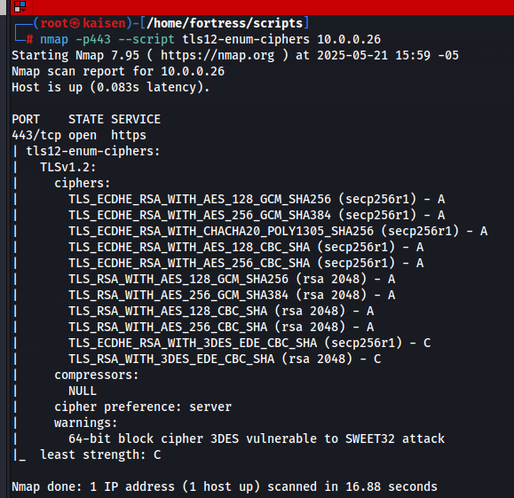

# tls1.2-enum-cipher.nse – Nmap Script for TLS 1.2 Cipher Enumeration

## Description

`tls1.2-enum-cipher.nse` is a custom **Nmap NSE script** designed to initiate a **TLS 1.2-specific handshake** with a target server in order to **enumerate supported cipher suites and compression methods**.

Unlike the official `ssl-enum-ciphers` script—which covers multiple protocol versions from SSLv3 to TLSv1.3—this script focuses **exclusively on TLS 1.2**, providing **deeper analysis and cleaner output** for this specific version.

---

## Installation

1. Clone this repository or download the `tls1.2-enum-cipher.nse` file.
2. Copy the script into Nmap’s script directory:

```bash
sudo cp tls1.2-enum-cipher.nse /usr/share/nmap/scripts/
```

3. Update Nmap’s script database to make it available for use:
```bash
sudo nmap --script-updatedb
```

## Usage

Run the script against a target host and port:
```bash
nmap -p 443 --script tls1.2-enum-cipher.nse <target>
```

## Expected Output

The script returns a list of supported TLS 1.2 cipher suites and compression methods, offering precise and targeted output for analysis.




## Disclaimer
This script is intended for educational and research purposes only.  
Do not use this tool on systems you do not own or lack explicit authorization to test.  
The author assumes no responsibility for misuse or illegal use of this software.  
